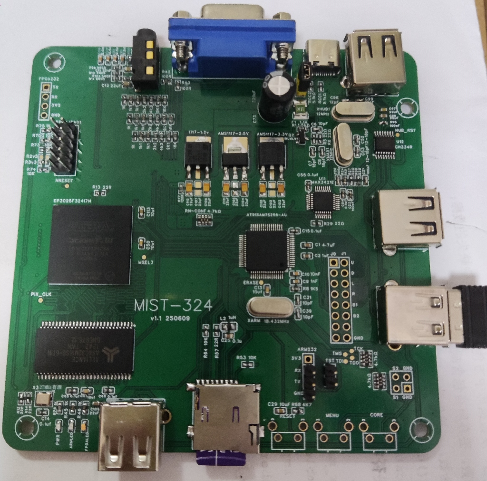

## MiST324
EP3C25F324-BGA324 PCB variant of [MIST FPGA](https://github.com/mist-devel/mist-board/wiki) project

Tech specs:
- based on MIST.1010 rev.A2
- Replace EP3C25E144 to EP3C25F324, for cost down ( EP3C25E144 RMB:250￥, but EP3C25F324 only RMB:50￥ )

### DO NOT SOLDER R2v5 and R3v3 at the same time,ONLY solder R3v3 for USB Blaster

### Useful links
* MIST wiki: [link](https://github.com/mist-devel/mist-board/wiki)
* MIST cores and firmwares: [link](https://github.com/mist-devel/mist-binaries)
* MIST.1010: [link] https://github.com/UzixLS/mist1010-board